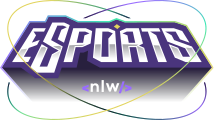
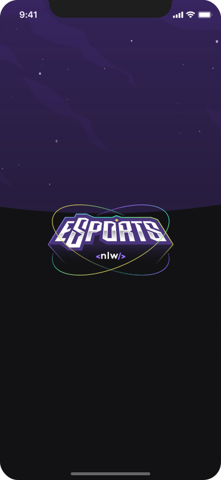
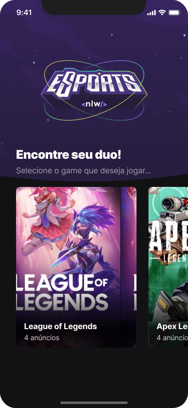
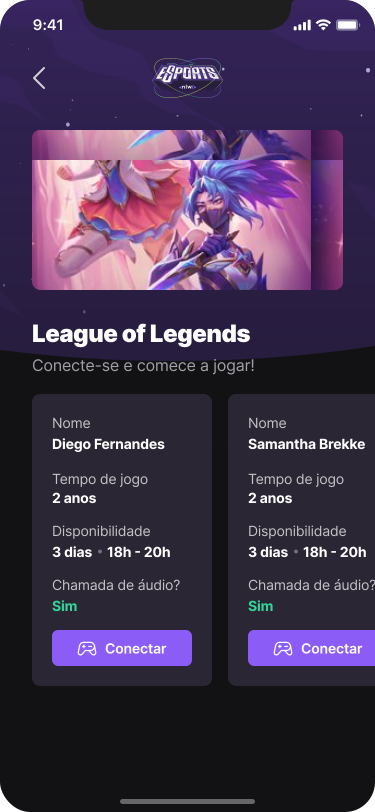
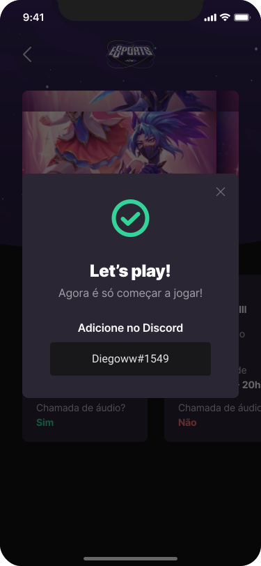

<h1 align="center">
    
    <br />
    <br />
    
    Find Your Duo
</h1>

<p align="center">
  <a href="#-tecnologias">Tecnologias</a>&nbsp;&nbsp;&nbsp;|&nbsp;&nbsp;&nbsp;
  <a href="#-projeto">Projeto</a>&nbsp;&nbsp;&nbsp;|&nbsp;&nbsp;&nbsp;
  <a href="#-layout">Layout</a>&nbsp;&nbsp;&nbsp;|&nbsp;&nbsp;&nbsp;
  <a href="#-licença">Licença</a>
</p>

<p align="center">
  
  
</p>

<br>

<p align="center">
  
  
</p>
  
<p align="center">
  
  
</p>

<br>

## 🚀 Tecnologias

Esse projeto foi desenvolvido com as seguintes tecnologias:

- [React Native](https://reactjs.org/)
- [TypeScript](https://www.typescriptlang.org/)

<br>

## 💻 Projeto

A versão mobile do Find Your Duo permite que os jogadores encontrem os anúncios de outros jogadores para cada jogo. A partir do anúncio, o jogador também consegue visualizar o Discord daquele outro jogador para se conectarem.

<br>

## Como executar?

Primeiro é preciso instalar o cliente Expo globalmente. Para isso, execute os seguintes comandos no terminal:

```
$ npm install
$ npm install -g expo-cli
```


Para iniciar o cliente mobile local com o Expo, execute os seguintes comandos no terminal:

```
$ npm run start
```

Caso você não tenha um emulador na sua máquina, instale o aplicativo [Expo](https://play.google.com/store/apps/details?id=host.exp.exponent&hl=pt_BR&gl=US) em seu smartphone e escaneie o QRCode que aparecerá no terminal.

**Observação:** Em caso de qualquer problema durante a execução da aplicação, consulte os erros mais comuns neste [link](https://github.com/Rocketseat/expo-common-issues).

<br>

## 🔖 Layout

Você pode visualizar o layout do projeto através desse [link](https://www.figma.com/file/9Azdqg7liIqt8mhCcvrlWZ/NLW-eSports-(Community)?node-id=459%3A1845).

<br>

## 📝 Licença

Esse projeto está sob a licença MIT. Veja o arquivo [LICENSE](LICENSE.md) para mais detalhes.

<br>

---

Projeto idealizado por Rocketseat ([Participe da comunidade!](https://discordapp.com/invite/gCRAFhc))